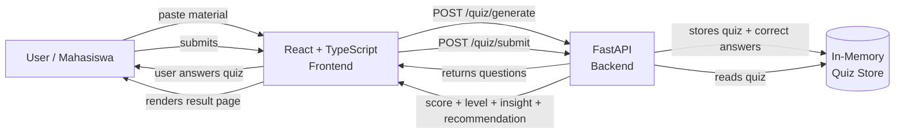
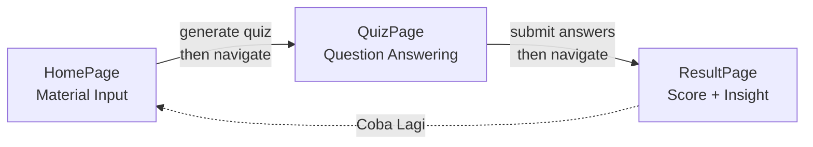
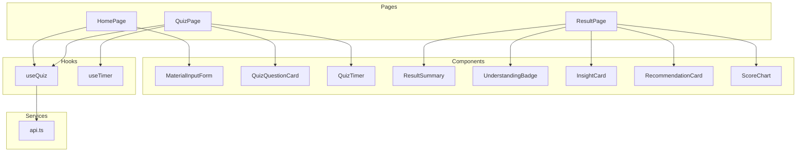
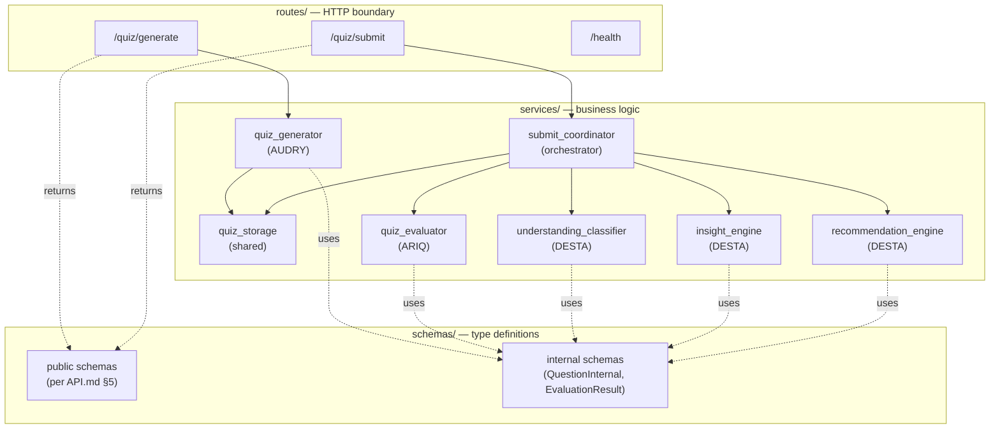
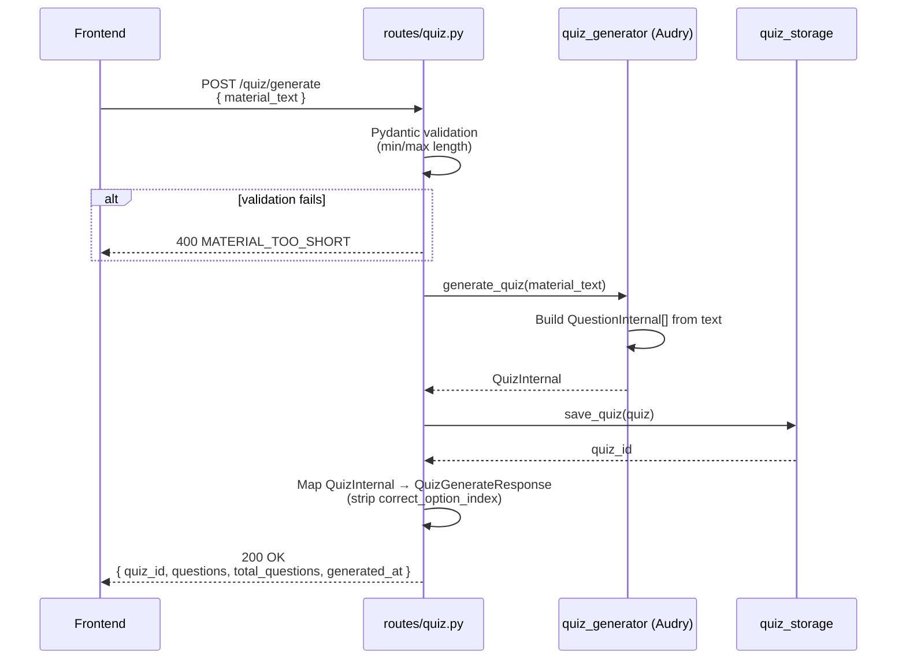
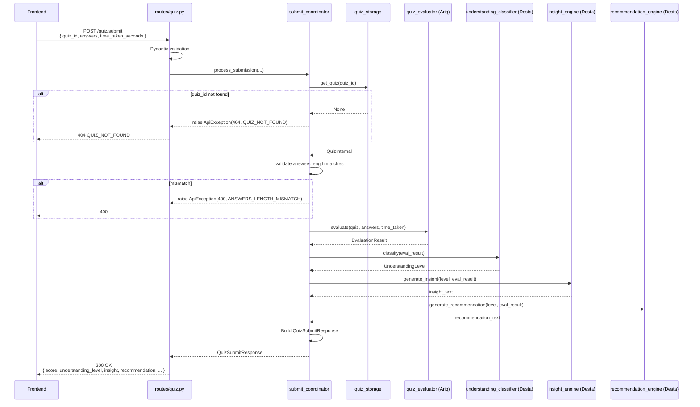
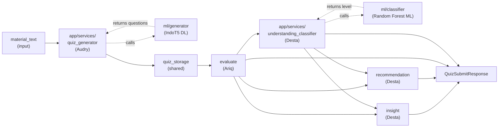
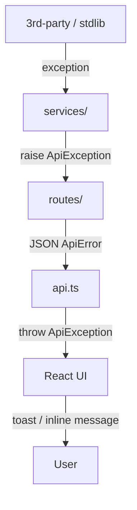
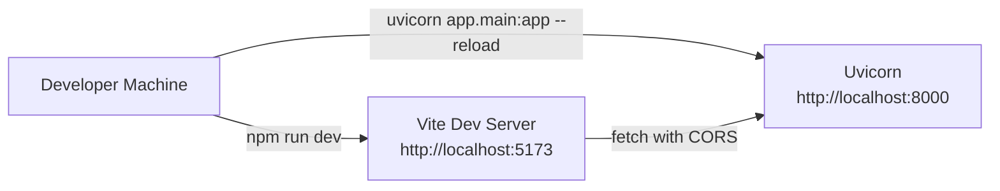

# Architecture — TempaCapstoneProject

**Project**: Sistem Deteksi Tingkat Pemahaman Mahasiswa Berdasarkan Hasil Kuis Berbasis Data
**Team**: TP-G005
**Status**: Draft v1.0 — needs team review before lock-in
**Last updated**: 2026-05-04

---

## 1. Purpose of this Document

This document describes **how the system is composed internally** — the modules, their responsibilities, how data flows between them, and the function-level contracts between backend services.

> Compare with sister documents:
> - `API.md` — the **HTTP contract** (frontend ↔ backend)
> - `ARCHITECTURE.md` (this) — the **internal structure** (frontend modules + backend modules + how they connect)
> - `CLASSIFICATION_RULES.md` (TBD) — the **business rules** (how Desta's logic actually decides high/medium/low)

The reader most served by this document is the backend team — Audry, Ariq, Desta — because their three services have a hard dependency chain (`generator → evaluator → classifier → insight → recommendation`). Getting the function signatures right here means each developer can implement their module in isolation and have everything click together at integration time.

---

## 2. System Overview

A user pastes learning material into the React frontend. The frontend posts the material to a Python (FastAPI) backend, which generates a quiz and returns the questions (without correct answers). The user answers the quiz; the frontend submits the answers; the backend evaluates the score, classifies the understanding level, generates an insight and a recommendation, and returns the full result. The frontend renders the result page with a chart.



### High-level technology choices

| Layer | Technology | Why |
|---|---|---|
| Frontend | React + TypeScript + Vite | Per proposal & CLAUDE.md. Vite for fast dev server. |
| UI primitives | shadcn/ui + Tailwind CSS | Per design discussion. Emerald base from `DESIGN.md`. |
| Backend (web) | Python 3.11+ + FastAPI | Per proposal. FastAPI for Pydantic validation + auto-docs. |
| Server | Uvicorn (dev), single-process | MVP doesn't need multi-worker. |
| Data layer | In-memory dict | Demo single-session. See §7 for migration path. |
| **DL framework** | **PyTorch + Hugging Face Transformers** | For Audry's quiz generator (text generation requires DL). |
| **DL model** | **`Wikidepia/IndoT5-base`**, fine-tuned on TyDiQA-id | Indonesian-specific T5; sufficient quality for QG. |
| **DL training** | **Google Colab (free GPU T4)** | No local GPU; Colab handles fine-tuning in 1-2 hours. |
| **Model hosting** | **Hugging Face Hub (free)** | Reliable distribution; backend pulls at startup. |
| **ML conv** | **scikit-learn** | Random Forest for understanding classification (tabular). |
| **ML conv training** | **Local CPU** | sklearn trains in <1 minute; no GPU needed. |
| **ML conv data** | **Synthetic generation in Python** | ~10k samples programmatically created from rule-based labels + noise. |
| **Pandas** | data manipulation in Ariq's evaluator | Optional but useful for analytics. |

---

## 3. Repository Layout

```
TempaCapstoneProject/
├── frontend/
│   ├── src/
│   │   ├── pages/                  # HomePage, QuizPage, ResultPage
│   │   ├── components/             # MaterialInputForm, QuizQuestionCard, ...
│   │   ├── hooks/                  # useQuiz, useTimer
│   │   ├── services/
│   │   │   └── api.ts              # API client (per API.md §10)
│   │   ├── types/
│   │   │   ├── quiz.ts             # mirrors API.md §5.2-5.5
│   │   │   ├── result.ts           # mirrors API.md §5.1, 5.5
│   │   │   └── api.ts              # mirrors API.md §5.6
│   │   ├── utils/                  # i18n labels, formatters
│   │   ├── App.tsx
│   │   └── main.tsx
│   ├── index.html
│   ├── package.json
│   └── vite.config.ts
│
├── backend/
│   ├── app/                        # WEB SERVICE LAYER (HTTP, business logic)
│   │   ├── main.py                 # FastAPI app, exception handlers, CORS
│   │   ├── routes/
│   │   │   ├── health.py           # GET /health
│   │   │   └── quiz.py             # POST /quiz/generate, /quiz/submit
│   │   ├── services/               # thin wrappers; ML calls go to ml/ layer
│   │   │   ├── quiz_generator.py           # AUDRY — wraps ml/generator/inference.py
│   │   │   ├── quiz_storage.py             # shared (Audry seeds, Ariq reads)
│   │   │   ├── quiz_evaluator.py           # ARIQ (no ML, pure scoring)
│   │   │   ├── understanding_classifier.py # DESTA — wraps ml/classifier/inference.py
│   │   │   ├── insight_engine.py           # DESTA (template-based)
│   │   │   ├── recommendation_engine.py    # DESTA (template-based)
│   │   │   └── submit_coordinator.py       # orchestrator (any owner)
│   │   ├── schemas/
│   │   │   ├── quiz.py             # public types: Question, Answer, ...
│   │   │   ├── result.py           # public types: ScoreSummary, ...
│   │   │   ├── internal.py         # internal-only: QuestionInternal, QuizInternal, EvaluationResult
│   │   │   └── error.py            # ApiError, ApiException
│   │   └── utils/
│   │       └── errors.py           # ApiException, error code constants
│   ├── ml/                         # ML/DL LAYER (training + inference)
│   │   ├── classifier/             # DESTA — conventional ML
│   │   │   ├── data_generation.py  # synthetic dataset generator
│   │   │   ├── train.py            # sklearn Random Forest training
│   │   │   ├── inference.py        # load .pkl + predict (called from app)
│   │   │   └── artifacts/
│   │   │       └── classifier.pkl  # trained model (committed)
│   │   ├── generator/              # AUDRY — DL
│   │   │   ├── inference.py        # load IndoT5 from HF Hub + generate
│   │   │   └── notebooks/
│   │   │       └── train_quiz_generator.ipynb  # Colab fine-tuning notebook
│   │   ├── requirements-ml.txt     # heavy training deps (torch, transformers)
│   │   └── README.md               # how to train each model
│   ├── tests/
│   │   ├── test_quiz_generator.py
│   │   ├── test_quiz_evaluator.py
│   │   ├── test_understanding_classifier.py
│   │   ├── test_insight_engine.py
│   │   ├── test_recommendation_engine.py
│   │   └── test_routes.py
│   └── requirements.txt            # base + lightweight ML inference deps
│
├── docs/                           # supporting docs (optional later)
├── CLAUDE.md
├── PRD.md
├── TASKS.md
├── README.md
├── DESIGN.md
├── API.md
├── ARCHITECTURE.md                 # this file
└── preview.html
```

> **Module ownership** is annotated inline above. A file marked `# AUDRY` means Audry owns it; the others should not edit it without coordinating. `# shared` means multiple owners can touch it but should keep changes minimal.

---

## 4. Frontend Architecture

### 4.1 Page structure

Three pages, each with a clear single responsibility:



| Page | Responsibility | Calls |
|---|---|---|
| `HomePage` | Accept material text, validate length, trigger generate, show loading state | `POST /quiz/generate` |
| `QuizPage` | Render questions, track selected option per question, run timer, allow submit | `POST /quiz/submit` |
| `ResultPage` | Display score, level badge, insight, recommendation, chart | none (renders submit response) |

### 4.2 Component layers



### 4.3 State management

**Approach**: local component state + React Router URL navigation. **No global state library** in MVP (Redux / Zustand are overkill).

State held where:
- `material_text` — local state in `HomePage`
- `quiz_id` + `questions` — passed via React Router state to `QuizPage`, OR refetched if direct-navigated
- `answers[]` — local state in `QuizPage`, one entry per question, `selected_option_index: null` until user picks
- `time_taken_seconds` — held by `useTimer` hook, captured at submit
- `submit_response` — passed via React Router state to `ResultPage`

> **Anti-pattern to avoid**: don't store `quiz_id` in localStorage / sessionStorage. The backend's in-memory store doesn't survive restarts, so a stored `quiz_id` would 404 on submit. Keep all state in-memory in React.

### 4.4 API client

Single source of API access lives in `frontend/src/services/api.ts`. See `API.md` §10 for the exact pattern. **No component should call `fetch` directly** — they import from `api.ts`.

### 4.5 Routing

```ts
// frontend/src/App.tsx
<Routes>
  <Route path="/" element={<HomePage />} />
  <Route path="/quiz" element={<QuizPage />} />
  <Route path="/result" element={<ResultPage />} />
</Routes>
```

Direct navigation to `/quiz` or `/result` without state → redirect to `/` (avoid orphan empty page).

---

## 5. Backend Architecture

### 5.1 Module decomposition



### 5.2 Layer responsibilities

| Layer | Responsibility | What it does NOT do |
|---|---|---|
| `routes/` | HTTP-level concerns: parse request, call service, format response | NO business logic, NO data manipulation |
| `services/` | All business logic: generation, evaluation, classification, insight, recommendation | NO HTTP knowledge, NO Pydantic request models |
| `schemas/` | Type definitions only — Pydantic for boundaries, dataclass/Pydantic for internal | NO logic |
| `utils/` | Cross-cutting helpers (errors, constants) | NO state |

> **The single most important rule**: `routes/` is **thin**. A route function reads the request, validates basics via Pydantic, calls one service function, and returns the response. Anything more belongs in a service.

### 5.3 Module ownership and boundaries

| Module | Owner | Pure function? | Inputs (internal type) | Output (internal type) |
|---|---|---|---|---|
| `quiz_generator.py` (app) | Audry | no (calls DL) | `material_text: str` | `QuizInternal` |
| `quiz_storage.py` | shared | no (stateful) | `QuizInternal` | `quiz_id: str` / `QuizInternal \| None` |
| `quiz_evaluator.py` | Ariq | yes | `QuizInternal`, `list[Answer]`, `time_taken_seconds: int` | `EvaluationResult` |
| `understanding_classifier.py` (app) | Desta | no (calls ML) | `EvaluationResult` | `UnderstandingLevel` |
| `insight_engine.py` | Desta | yes | `UnderstandingLevel`, `EvaluationResult` | `str` (Indonesian) |
| `recommendation_engine.py` | Desta | yes | `UnderstandingLevel`, `EvaluationResult` | `str` (Indonesian) |
| `submit_coordinator.py` | orchestrator (any owner) | no (calls others) | `quiz_id`, `answers`, `time_taken_seconds` | `QuizSubmitResponse` |

> **"Pure function" means**: same input always produces same output, no I/O, no global mutation. Every service marked `pure` MUST be testable with simple `assert eq(f(input), expected)` — no mocks needed.
>
> **`quiz_generator.py` and `understanding_classifier.py` are NOT pure** because they delegate to the ML layer (`backend/ml/*/inference.py`), which loads models from disk/network. They are tested via integration tests, not pure unit tests.

---

## 5b. ML Layer (`backend/ml/`)

ML/DL training + inference is **separated from the web app layer**. The web app calls into `ml/` only at inference time. Training is a separate process.

### Why separate `ml/` from `app/`?

1. **Different concerns**: training loads datasets, fits models, dumps artifacts. Web app loads artifacts, runs predictions. These don't share runtime requirements.
2. **Different dependencies**: training needs `torch`, `transformers`, `datasets`, `accelerate` (~2GB combined). Web app at runtime needs only inference subset.
3. **Different lifecycle**: training is one-shot per model version. Web app is long-running.
4. **Reproducibility**: every model artifact in `ml/*/artifacts/` should be reproducible from training scripts.

### Module ownership in `ml/`

| Module | Owner | Purpose |
|---|---|---|
| `ml/generator/inference.py` | Audry | Load fine-tuned IndoT5 from Hugging Face Hub. `generate(material) -> list[QuestionInternal]`. |
| `ml/generator/notebooks/train_quiz_generator.ipynb` | Audry | Colab notebook: download TyDiQA-id, fine-tune IndoT5-base, push to HF Hub. |
| `ml/classifier/data_generation.py` | Desta | Generate ~10k synthetic samples (score, time, etc → label). |
| `ml/classifier/train.py` | Desta | Train sklearn Random Forest, save `classifier.pkl` to `artifacts/`. |
| `ml/classifier/inference.py` | Desta | Load `.pkl` and predict. Called from `app/services/understanding_classifier.py`. |

### Inference contract (the boundary)

The web app layer calls into `ml/` via simple function imports — NOT via HTTP, NOT via subprocess. Same Python process, just different module.

```python
# app/services/quiz_generator.py
from ml.generator import inference as gen_inference

def generate_quiz(material_text: str) -> QuizInternal:
    questions = gen_inference.generate(material_text)  # may take 15-40s on CPU
    return QuizInternal(quiz_id=str(uuid.uuid4()), questions=questions, ...)
```

```python
# ml/generator/inference.py
from transformers import T5ForConditionalGeneration, T5Tokenizer

# Load once at module import (cached for app lifetime)
_MODEL_NAME = "audry-asahlagi/indot5-quizgen-asahlagi"
_tokenizer = T5Tokenizer.from_pretrained(_MODEL_NAME)
_model = T5ForConditionalGeneration.from_pretrained(_MODEL_NAME)

def generate(material_text: str) -> list[QuestionInternal]:
    # ... inference logic ...
    return questions
```

### Model loading strategy

Both DL and ML conv models are loaded **once at app startup** (when the module is first imported) and cached for the app's lifetime. Subsequent inference calls skip the load step.

- DL model: ~5-10s startup overhead (downloads ~1GB on first run if not cached locally)
- ML conv model: ~50ms startup overhead (load `.pkl`)

This means the **first request after server boot is slow** (model loading happens on first import); subsequent requests skip the load.

### Fallback strategy

Both `ml/generator/inference.py` and `ml/classifier/inference.py` MUST gracefully degrade to rule-based logic if model loading fails. The placeholder implementations from before scaffolding stay in the codebase as fallback paths.

```python
try:
    _model = T5ForConditionalGeneration.from_pretrained(_MODEL_NAME)
    _USE_DL = True
except Exception as e:
    log.warning("DL model load failed, using rule-based fallback: %s", e)
    _USE_DL = False
```

This protects the demo from network/HF outages.

---

## 6. Internal Type Definitions

Public types (for HTTP) live in `backend/app/schemas/quiz.py` and `result.py` and are documented in `API.md` §5. Internal-only types (never exposed over HTTP) live in `backend/app/schemas/internal.py` and are documented HERE.

### 6.1 `QuestionInternal`

Like the public `Question`, but with the correct option index attached. Never returned over HTTP.

```python
# backend/app/schemas/internal.py
from pydantic import BaseModel, Field, conlist

class QuestionInternal(BaseModel):
    id: int = Field(..., ge=1)
    question: str
    options: conlist(str, min_length=4, max_length=4)
    correct_option_index: int = Field(..., ge=0, le=3)

    def to_public(self) -> "Question":
        """Strip correct_option_index for client."""
        from app.schemas.quiz import Question
        return Question(id=self.id, question=self.question, options=list(self.options))
```

### 6.2 `QuizInternal`

The full quiz as stored server-side.

```python
class QuizInternal(BaseModel):
    quiz_id: str
    questions: list[QuestionInternal]
    generated_at: datetime
    source_material_excerpt: str  # first 500 chars, for debugging

    @property
    def total_questions(self) -> int:
        return len(self.questions)
```

### 6.3 `EvaluationResult`

The output of `quiz_evaluator.evaluate()`. Consumed by all 3 of Desta's modules.

```python
class EvaluationResult(BaseModel):
    correct_count: int = Field(..., ge=0)
    wrong_count: int = Field(..., ge=0)
    unanswered_count: int = Field(..., ge=0)
    total_questions: int = Field(..., ge=1)
    score_percentage: int = Field(..., ge=0, le=100)
    time_taken_seconds: int = Field(..., ge=0)

    # Per-question detail (useful for richer insights post-MVP)
    question_results: list["QuestionResult"]

class QuestionResult(BaseModel):
    question_id: int
    selected_option_index: int | None
    correct_option_index: int
    is_correct: bool
    is_unanswered: bool
```

> `EvaluationResult` is the **handoff point** between Ariq and Desta. Ariq's `evaluate()` produces it; Desta's three modules consume it. If this shape changes, all three of Desta's modules must be updated.

---

## 7. Storage Layer

### 7.1 In-memory store (MVP)

```python
# backend/app/services/quiz_storage.py
from typing import Optional
from collections import OrderedDict
from app.schemas.internal import QuizInternal

_MAX_QUIZZES = 100
_store: OrderedDict[str, QuizInternal] = OrderedDict()

def save_quiz(quiz: QuizInternal) -> str:
    _store[quiz.quiz_id] = quiz
    if len(_store) > _MAX_QUIZZES:
        _store.popitem(last=False)  # FIFO eviction
    return quiz.quiz_id

def get_quiz(quiz_id: str) -> Optional[QuizInternal]:
    return _store.get(quiz_id)

def clear_all() -> None:
    """Test-only utility."""
    _store.clear()
```

**Properties**:
- Thread-safe enough for single-worker uvicorn (Python GIL covers dict ops)
- Lost on restart (acceptable for demo)
- FIFO-evicted at 100 entries (prevents unbounded memory)

### 7.2 Migration path (post-MVP, NOT IMPLEMENTED)

If persistent storage is added later:
1. Replace `_store: OrderedDict` with SQLite (`sqlite3` stdlib).
2. Add `expires_at` column → auto-evict via `WHERE expires_at > now()`.
3. Function signatures stay the same → callers don't change.

This is why `quiz_storage.py` is a separate module: encapsulating storage so only one file changes when the strategy evolves.

---

## 8. Data Flow — Generate Quiz



### Function signatures

```python
# routes/quiz.py
@router.post("/quiz/generate", response_model=QuizGenerateResponse)
def generate_quiz_endpoint(req: QuizGenerateRequest) -> QuizGenerateResponse:
    quiz_internal = quiz_generator.generate_quiz(req.material_text)
    quiz_storage.save_quiz(quiz_internal)
    return QuizGenerateResponse(
        quiz_id=quiz_internal.quiz_id,
        questions=[q.to_public() for q in quiz_internal.questions],
        total_questions=quiz_internal.total_questions,
        generated_at=quiz_internal.generated_at,
    )
```

```python
# services/quiz_generator.py — AUDRY
def generate_quiz(material_text: str) -> QuizInternal:
    """Generate a quiz from learning material.
    Returns 5-10 questions with exactly 4 options each, one correct.
    Raises ApiException(QUIZ_GENERATION_FAILED) on internal failure.
    """
    ...
```

---

## 9. Data Flow — Submit Quiz

This is the more complex flow because it crosses 4 services.



### Function signatures

```python
# services/submit_coordinator.py
def process_submission(
    quiz_id: str,
    answers: list[Answer],
    time_taken_seconds: int,
) -> QuizSubmitResponse:
    """Orchestrate the full submit pipeline.
    Raises ApiException for any validation/business error.
    """
    quiz = quiz_storage.get_quiz(quiz_id)
    if quiz is None:
        raise ApiException(404, "QUIZ_NOT_FOUND", "Kuis tidak ditemukan atau sudah kedaluwarsa.")

    if len(answers) != quiz.total_questions:
        raise ApiException(400, "ANSWERS_LENGTH_MISMATCH",
                           "Jumlah jawaban tidak sesuai dengan jumlah soal.")

    eval_result = quiz_evaluator.evaluate(quiz, answers, time_taken_seconds)
    level = understanding_classifier.classify(eval_result)
    insight = insight_engine.generate_insight(level, eval_result)
    recommendation = recommendation_engine.generate_recommendation(level, eval_result)

    return QuizSubmitResponse(
        quiz_id=quiz_id,
        score=ScoreSummary(
            score_percentage=eval_result.score_percentage,
            correct_count=eval_result.correct_count,
            wrong_count=eval_result.wrong_count,
            unanswered_count=eval_result.unanswered_count,
            total_questions=eval_result.total_questions,
        ),
        time_taken_seconds=time_taken_seconds,
        understanding_level=level,
        insight=insight,
        recommendation=recommendation,
        chart_data=ChartData(
            correct=eval_result.correct_count,
            wrong=eval_result.wrong_count,
            unanswered=eval_result.unanswered_count,
        ),
        submitted_at=datetime.utcnow(),
    )
```

```python
# services/quiz_evaluator.py — ARIQ
def evaluate(
    quiz: QuizInternal,
    answers: list[Answer],
    time_taken_seconds: int,
) -> EvaluationResult:
    """Evaluate user answers against the stored quiz.
    Computes score, counts, and per-question result detail.
    """
    ...
```

```python
# services/understanding_classifier.py — DESTA
def classify(eval_result: EvaluationResult) -> UnderstandingLevel:
    """Apply rule-based classification.
    See CLASSIFICATION_RULES.md for the actual rules.
    """
    ...
```

```python
# services/insight_engine.py — DESTA
def generate_insight(
    level: UnderstandingLevel,
    eval_result: EvaluationResult,
) -> str:
    """Generate a 1-2 sentence Indonesian insight string."""
    ...
```

```python
# services/recommendation_engine.py — DESTA
def generate_recommendation(
    level: UnderstandingLevel,
    eval_result: EvaluationResult,
) -> str:
    """Generate a 1-2 sentence Indonesian recommendation string."""
    ...
```

---

## 10. Module Dependency Graph

The hard dependency chain that drives task ordering:



### What this graph implies for task ordering

1. **`EvaluationResult` shape (Ariq) blocks all 3 of Desta's modules.** Ariq must publish a stable `EvaluationResult` shape FIRST. Until then, Desta can implement against a mock `EvaluationResult`.
2. **`QuestionInternal` shape (Audry) blocks Ariq.** Audry should publish the `QuestionInternal` shape early; Ariq's evaluator depends on `correct_option_index`.
3. **The whole submit chain** can be tested end-to-end only when all 4 backend modules exist. Until then, `submit_coordinator` is the integration test target.

### Suggested order of implementation

1. **Day 1 (all)**: review and lock §6 internal types. This is the integration contract.
2. **Day 2-3 (Audry)**: implement `quiz_generator` + `quiz_storage` with `QuestionInternal` and `QuizInternal`. Provide a fixture quiz for Ariq to test against.
3. **Day 2-3 (Desta)**: implement `understanding_classifier`, `insight_engine`, `recommendation_engine` against a **mock `EvaluationResult`** (write fixtures in tests). Doesn't need Ariq finished.
4. **Day 3-4 (Ariq)**: implement `quiz_evaluator` once Audry's `QuizInternal` is in. Replace Desta's mock fixtures with real evaluator output.
5. **Day 4 (any)**: implement `submit_coordinator` to orchestrate. Routes wire it up.

This ordering means **Audry and Desta can work in parallel from Day 2**, and Ariq only blocks after Day 3 once Audry lands. Frontend (Ravi) can mock the entire backend response from Day 1 using fixtures derived from `API.md`.

---

## 11. Error Handling Strategy

### Error sources and propagation



### Rules

1. **Services raise `ApiException`** with `(status_code, code, detail)`. They do NOT raise `HTTPException` directly, do NOT return error tuples, do NOT print + return None.
2. **Routes do NOT try/except generic exceptions.** A global exception handler (in `main.py`) catches `ApiException` and uncaught exceptions, formatting both as `ApiError` responses.
3. **Uncaught exceptions are 500 with `code=INTERNAL_ERROR`** and a generic Indonesian message. The actual exception is logged server-side.
4. **Pydantic validation errors** are caught by FastAPI's default 422 handler. Frontend treats 422 the same as 400 for display purposes (both → "Input tidak valid").
5. **Frontend `api.ts` throws `ApiException`** on every non-2xx response. Components catch it via try/await or React Query's error handling.

### Anti-patterns to avoid

- ❌ `return None` from a service to signal an error — caller has no idea why
- ❌ `raise Exception("foo")` from a service — no status code, no error code
- ❌ Catching exceptions in a route just to log them — let the global handler do it
- ❌ Returning HTTP 200 with `{ "error": "..." }` body — use proper status codes

---

## 12. Frontend ↔ Backend Coupling Points

These are the only places where the two halves of the codebase reference shared knowledge:

| Coupling point | Source of truth | Mirrored in |
|---|---|---|
| HTTP endpoints (URL, method, status) | `API.md` §4 | `frontend/src/services/api.ts`, `backend/app/routes/quiz.py` |
| Request/response shapes | `API.md` §5 | `frontend/src/types/*.ts`, `backend/app/schemas/quiz.py`, `result.py` |
| Error codes | `API.md` §6 | `frontend/src/services/api.ts` (ApiException handler), `backend/app/utils/errors.py` |
| `UnderstandingLevel` enum | `API.md` §5.1 | both sides |

> **Drift detection**: pick ONE shape and add an integration test that runs the backend, calls each endpoint with fixtures, and asserts the response matches a frontend-side TypeScript-derived JSON schema. (Out of MVP scope, but tracked for post-MVP.)

---

## 13. Deployment Architecture

### 13.1 Local development



- Frontend runs on `localhost:5173` (Vite default).
- Backend runs on `localhost:8000` (Uvicorn).
- Backend enables CORS for `localhost:5173` (per `API.md` §9).
- `VITE_API_BASE_URL=http://localhost:8000` in `frontend/.env.development`.

### 13.2 Demo deployment (TBD)

For the final demo, options:
1. **Local on demo machine**: simplest. Run both servers side-by-side. Risk: network blips during presentation.
2. **Tunneled (ngrok / cloudflared)**: backend stays local, frontend hosted on Vercel/Netlify with `VITE_API_BASE_URL` pointing to tunnel URL. Risk: tunnel expires.
3. **Single deploy (FastAPI serves React build)**: backend's `app/main.py` mounts `frontend/dist` as static files. Single port, no CORS. Best for demo.

> **Recommendation**: option 3 for demo. Add a `Makefile` target `make demo-build` that runs `npm run build` and copies `dist/` into a backend-served path. Defer setup to Week 5.

---

## 14. Sign-off

This architecture requires sign-off from the team before we lock the internal types in §6 (because that's the integration boundary).

- [ ] **Audry** — `QuestionInternal` and `QuizInternal` are sufficient for `generate_quiz`
- [ ] **Ariq** — `EvaluationResult` shape is sufficient for downstream classifier/insight/recommendation
- [ ] **Desta** — `EvaluationResult` provides everything needed for `classify`, `generate_insight`, `generate_recommendation`
- [ ] **Ravi** — frontend module structure (§4) and routing strategy match the planned UX

---

## Changelog

- **v1.0 (2026-05-04)** — Initial draft: system overview, frontend modules, backend modules, internal types, data flow diagrams, dependency graph, error strategy, deployment notes. Awaiting team review.
