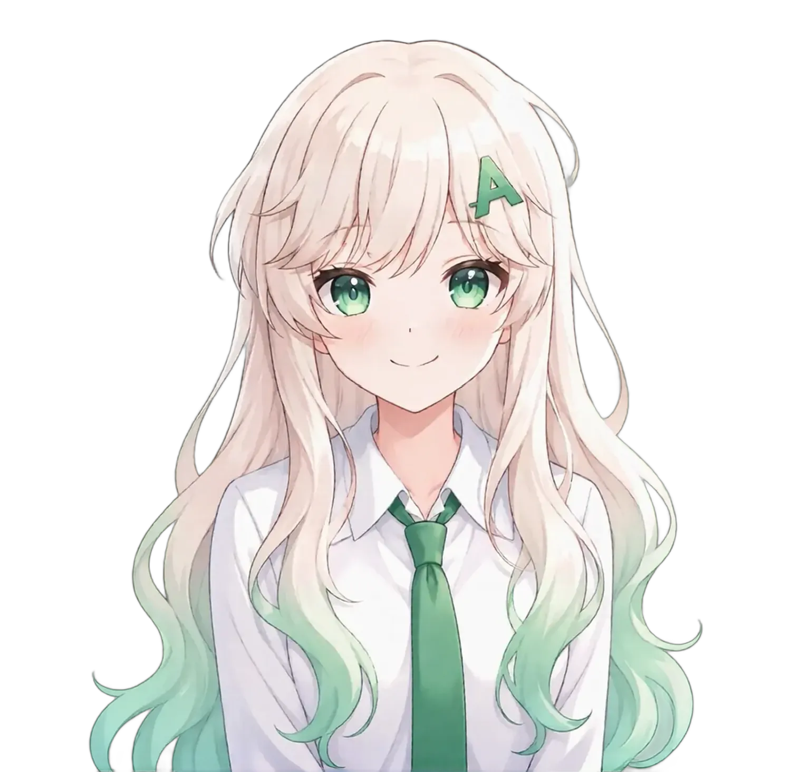

# Brand — Asahlagi

**Project**: Sistem Deteksi Tingkat Pemahaman Mahasiswa Berdasarkan Hasil Kuis Berbasis Data
**Team**: TP-G005
**Status**: Draft v1.1 — needs team review before lock-in
**Last updated**: 2026-05-04

---

## 1. Overview

This document is the **brand single source of truth** for the capstone product. It defines the product name, tagline, voice & tone, copy guidelines, and visual brand applications.

### How this differs from DESIGN.md
- **DESIGN.md** = visual layer (color tokens, typography, spacing, components, dark/light mode rules). _What things look like._
- **BRAND.md** (this) = brand layer (name, voice, copy, logo, do's/don'ts, brand applications). _What the product feels like and sounds like._

If you're picking colors or sizing components, go to DESIGN.md. If you're writing button labels, error messages, or any user-facing copy, go here.

### Critical context: Asahlagi ≠ Tempa
- **Asahlagi** is the name of THIS capstone product.
- **Tempa** is the name of the upstream learning program (akademi/bootcamp) under which this capstone is being built.
- These are **two distinct brands**. When ambiguous in writing, use:
  - "Asahlagi (capstone TP-G005)" when referring to this product
  - "Tempa (program pembelajaran)" when referring to the program

---

## 2. Brand Identity

### Name: **Asahlagi**

**Pronunciation**: `/ˈʔasahˌlagi/` — _ah-sah-lah-gi_, four syllables, soft glottal stop at the start. Stress on the first and third syllables (ah-sah-LAH-gi).

**Spelling & casing**:
- Default: lowercase one-word in body copy and wordmark — `asahlagi`
- Sentence-start, headlines, proper noun reference: capitalized — `Asahlagi`
- Never use spaces (`asah lagi`) — that's the verb phrase, not the brand
- Never use hyphens, dots, or underscores (`asah-lagi`, `asah.lagi`, `asah_lagi`)

**Etymology**: Compound of two Indonesian words —
- **asah** (verb) — _to sharpen, to hone_
- **lagi** (adverb) — _again, once more_

Together: **"sharpen again"**, or in spirit, **"keep sharpening"**.

**Why this name**:
1. **Encodes the product loop**. The capstone's core flow is iterative — read material, take quiz, see result, _asah lagi_ if not yet mantap. The name literally describes the user behavior the product is designed to enable.
2. **Honest, not boastful**. "Asahlagi" is a process, not an outcome. It avoids the over-promising tone of names like "Genius", "Master", or "Pro". It admits — built into the name — that one pass usually isn't enough.
3. **Distinctive as a brand**. While "asah" alone is generic vocabulary, the compound "asahlagi" reads unmistakably as a brand mark — like "Substack", "Hashnode", "Wikileaks". The compounding is the brand-able move.
4. **Action-oriented and rhythmic**. Four syllables with a clear stress pattern. Easy to say, hard to mistype, memorable.
5. **Fonetik Indonesia**. Native, easy to pronounce for the primary audience, no English-Indonesian code-switch.
6. **Parallel to Tempa**. Both names come from the Indonesian metalworking lexicon (tempa = forge, asah = sharpen). This is **deliberate**: the capstone _sharpens_ what the program _forges_. The thematic resonance reinforces the academic context without confusing the two as the same product.

### Tagline: **"Asah lagi sampai paham."**

The tagline plays directly on the product name. Reading "Asah lagi" first triggers brand recognition; "sampai paham" then completes the sentence with the goal — _until you understand_. The brand name and the tagline reinforce each other.

**Use in**:
- Hero subtitle on homepage
- Demo presentation title slide
- Social/share preview (post-MVP)
- Landing page meta description

**Alternatives** (kept for reference, _not_ default):
- "Asah lagi, paham lagi." — more rhythmic, less narrative
- "Uji. Pahami. Asah lagi." — three-step pattern
- "Belajar tanpa tebak-tebakan." — anti-pretension framing
- "Dari materi, ke pemahaman." — describes the transformation

### Mission statement (1 sentence)

> Asahlagi membantu mahasiswa mengukur pemahaman mereka setelah membaca materi belajar — bukan dengan menebak, tapi dengan menguji, lalu mengasah ulang sampai konsepnya benar-benar mantap.

### Elevator pitch (3-4 sentences)

> Mahasiswa sering membaca materi tanpa benar-benar mengukur pemahamannya. Asahlagi mengubah teks materi belajar menjadi kuis pilihan ganda secara otomatis, lalu menganalisis hasil pengerjaan untuk menampilkan tingkat pemahaman, insight singkat, dan rekomendasi belajar. Tidak ada AI yang berpura-pura cerdas — hanya aturan sederhana yang transparan dan langsung memberikan umpan balik. Kalau belum mantap? Tinggal asah lagi.

---

## 3. Visual Identity

### Logo files

All logo assets live in `assets/`:

| File | Purpose | Dimensions | Usage |
|---|---|---|---|
| `assets/logo.svg` | Full logo: icon + wordmark | 240 × 64 | Headers, navigation, presentations, README |
| `assets/logo-icon.svg` | Icon-only mark | 64 × 64 | Compact contexts, tight layouts, social profile pictures |
| `frontend/public/favicon.svg` | Favicon | 32 × 32 (optimized for 16) | Browser tab |

### Logo concept

The icon is a **stylized letter "A"** (the first letter of _Asahlagi_), rendered as:
- A solid emerald chevron forming the outer angled strokes
- A **diagonal slash** crossbar (going up-right) — replaces the conventional horizontal bar of the letter A

Visually it reads as:
- The letter "A" (first letter of "Asahlagi")
- An upward arrow / mountain peak (suggesting progression, sharpening, rising)
- A **checkmark integrated into the letter** — the diagonal slash reads like a tick of approval / sharpness / completion
- The tip of a sharpened blade (literal metaphor for "asah")

The slash crossbar is the **brand-distinguishing detail**. A regular horizontal bar would make the mark generic; the diagonal slash gives it personality and reinforces the brand themes of forward motion and sharpening.

### Logo variants

```
┌───────────────────────────────────────────────┐
│                                               │
│   [Icon]   asahlagi    ← Full (default)       │
│                                               │
└───────────────────────────────────────────────┘

┌──────────┐
│  [Icon]  │   ← Icon-only (favicon, small contexts)
└──────────┘

┌────────────────┐
│   asahlagi     │   ← Wordmark-only (rare; only when icon
└────────────────┘     would conflict, e.g. inside a form input)
```

### Clearspace

Around the full logo, leave **at least the height of the icon** as clearspace (≥ 64px around the 240×64 logo block). Around the icon-only mark, leave **at least 25% of the icon's width**.

### Minimum sizes

| Variant | Minimum size | Notes |
|---|---|---|
| Full logo | 140 px wide | Below this, switch to icon-only — the wordmark is longer than 4-letter brands so floor is slightly higher |
| Icon-only | 16 × 16 px | Favicon size; do not scale below |
| Wordmark-only | 100 px wide | Below this, switch to icon-only |

### Colors

The icon mark is always emerald `#3ecf8e` (the brand green from DESIGN.md, mode-agnostic).
The wordmark uses `currentColor` — it adopts the surrounding text color, which is:
- `#171717` (near-black) on light surfaces
- `#fafafa` (off-white) on dark surfaces

Never recolor the icon mark. If the brand emerald conflicts with the background, switch to the icon-only on a transparent or neutral surface, or use the full logo with reduced surrounding contrast — but **never** change the icon's hue.

### Background safe-zones

| Background | OK? | Notes |
|---|---|---|
| White (`#ffffff`) | ✅ Yes | Default light context |
| Off-white (`#fafafa`) | ✅ Yes | Default light alternate |
| Near-black (`#171717`) | ✅ Yes | Default dark context |
| Pure black (`#000000`) | ⚠️ Avoid | Use `#171717` instead — pure black breaks the design system's "never pure" rule |
| Emerald (`#3ecf8e`) | ❌ No | Icon disappears |
| Other brand colors (other green / blue / purple) | ❌ No | Wait for explicit approval |
| Photography / busy patterns | ❌ No | Add a solid-color plate behind the logo first |

### Logo don'ts

- ❌ Don't stretch the logo (preserve aspect ratio)
- ❌ Don't recolor the icon mark
- ❌ Don't add effects: drop shadow, glow, bevel, gradient, outline
- ❌ Don't rotate the logo
- ❌ Don't place text directly inside the logo's clearspace
- ❌ Don't break the wordmark across two lines (always single-line)
- ❌ Don't pair the logo with the "Tempa" wordmark in a way that suggests they're the same brand

---

## 4. Color Identity

The brand color system lives in **DESIGN.md** §2 (Color Palette & Roles). This section adds **brand-level meaning** to those tokens.

### What the colors mean for Asahlagi

| Color | Token | Brand meaning |
|---|---|---|
| Emerald `#3ecf8e` | `--brand-green` | Pemahaman yang sedang diasah. The signal of the brand — used as the identity marker, not as decoration. |
| Light Emerald `#008556` | `--brand-link` (light) | Action / link / progression. The brand's voice in a typographic form. |
| Light Button `#00875a` | `--brand-button` | Commitment moments. CTA buttons that move the user forward in the flow. |
| Page neutrals | `--bg-page`, `--text-primary` | Calm, focused canvas. Like a clean library reading desk. |
| Status emerald (Tinggi) | `--status-tinggi-bg` | Affirmation. Reserved for the highest understanding level — never used decoratively. |
| Status amber (Sedang) | `--status-sedang-bg` | Honest signal of "in-progress understanding". Not "warning" in a negative sense. |
| Status red (Rendah) | `--status-rendah-bg` | Honest signal of "needs more work". Not punishment — just direction. |

### Anti-pattern
Don't use emerald as a generic accent for unrelated UI ornaments. Reserve it for: brand identity, primary CTAs, "Tinggi" status, and links. Spreading emerald everywhere dilutes the brand signal.

---

## 5. Typography

The full typographic system is defined in **DESIGN.md** §3. This section adds brand-specific tightening.

### Wordmark typography

The "asahlagi" wordmark in `assets/logo.svg` uses:
- **Font**: Inter Medium (weight 500)
- **Size**: 32px in the canonical 240×64 logo
- **Letter-spacing**: −0.5px (tight, matches DESIGN.md §3 card-title tracking)
- **Case**: lowercase (deliberately friendly, fits casual-professional voice)
- **Color**: `currentColor` (inherits from CSS context)

### Body copy typography
Inherit from DESIGN.md. No brand-specific overrides.

### When to use monospace (JetBrains Mono)
- Technical labels (e.g., uppercase status badges like "TINGGI")
- Stats/numbers in the result card (e.g., "85%", "4:32")
- Code blocks in documentation

Never use monospace for body copy or marketing text — that's the developer-tool aesthetic, not the educational-tool aesthetic.

---

## 6. Voice & Tone

### Brand personality (4 attributes)

1. **Honest** — Asahlagi is rule-based, not AI-magic. Copy should never imply more sophistication than the product has. ("Sistem ini menganalisis pola jawabanmu" ✅, "AI canggih kami memprediksi pemahamanmu" ❌.)
2. **Encouraging tapi tidak cheesy** — affirm progress without over-rewarding. No "GREAT JOB!!!", no excessive emoji, no infantilizing language. Closer to a thoughtful tutor than a cheerleader.
3. **Calm, focused** — the tone is library, not arcade. Pacing is unhurried. Animations and copy don't urgently demand attention.
4. **Casual-professional Indonesian** — uses "kamu" (warm familiar) instead of "Anda" (formal distant). Avoids slang, English code-switching, and overly stiff formal phrasing. Indonesian-first, English secondary (and only when needed for technical terms).

### Tone dimensions

| Dimension | Lean toward | Avoid |
|---|---|---|
| Formality | Casual-professional ("kamu", contractions OK) | Stiff formal ("Anda dimohon untuk...") |
| Emotional register | Supportive, calm | Cheerleader-style or clinical-cold |
| Sentence length | Short to medium (5-15 words) | Long, comma-heavy academic sentences |
| Person | Second-person ("kamu") | Third-person passive ("pengguna disarankan...") |
| Punctuation | Standard, period-terminated | Excessive `!`, `???`, ALL CAPS |
| Emoji | None in MVP UI | Any emoji decorating copy |

### When the user makes a mistake
Do not blame. Frame the issue as a small obstacle, not a failure. Always include the next action.

- ✅ "Materinya terlalu pendek. Tambahkan minimal 100 karakter agar sistem bisa membuat kuis."
- ❌ "Error: input tidak valid. Anda harus mengisi field dengan benar."
- ❌ "Wah kamu salah nih, materi nya kurang banyak 😅"

### When the user does well
Affirm the substance, not the user. Avoid generic praise.

- ✅ "Skor tinggi dengan waktu pengerjaan efisien menunjukkan kamu menguasai konsep utama."
- ❌ "Wah hebat! Kamu jagoan! 🎉"
- ❌ "85% — kamu lulus!"

### When the user does poorly
Stay supportive and actionable. Frame as direction, not judgment.

- ✅ "Banyak konsep dasar yang masih perlu dipelajari ulang sebelum lanjut."
- ❌ "Skor rendah. Kamu perlu belajar lebih giat."
- ❌ "Sayang sekali, hasilmu kurang memuaskan."

### Brand-name moments

Use the brand name as a callback in moments where the loop completes:
- After a low result: _"Yuk asah lagi."_ — turns the brand into a friendly invitation back into the loop
- On a retry button: _"Asah Lagi"_ — the brand becomes the action
- In an empty state on the homepage after a previous session: _"Mau asah lagi?"_ — recognition without being pushy

This is the brand's signature move: the name itself is the callback.

---

## 7. Copy Examples

This is the most load-bearing section for development. **All Indonesian copy below is ready to be lifted directly into frontend code or backend response strings.** Update this section whenever new copy is needed; don't invent ad-hoc strings inline.

### 7.1 Page titles & headers

| Context | Copy |
|---|---|
| Homepage `<title>` | "Asahlagi — Asah lagi sampai paham." |
| Homepage hero | "Asah lagi sampai paham." |
| Homepage subtitle | "Tempel materi belajarmu, kerjakan kuis otomatis, dan ukur tingkat pemahamanmu." |
| Quiz page title | "Kuis sedang berlangsung" |
| Result page title (dynamic, by level) | See §7.5 |

### 7.2 Button labels

| Context | Copy | Notes |
|---|---|---|
| Primary CTA on homepage (first time) | "Mulai Mengasah" | Active verb form |
| Primary CTA on homepage (return user, post-MVP) | "Asah Lagi" | Brand-as-action callback |
| Loading state on homepage | "Sedang menyiapkan kuis..." | Disabled state |
| Submit quiz | "Selesai & Lihat Hasil" | Final action, prominent |
| Skip question | "Lewati" | Secondary |
| Previous question | "Sebelumnya" | Ghost |
| Next question | "Lanjut" | Secondary |
| Restart from result page | "Asah Lagi" | Primary on result page — **brand callback moment** |
| Reset (destructive) | "Mulai Ulang" | Destructive variant |
| Back to home | "Kembali ke Beranda" | Ghost |

### 7.3 Empty states

| Context | Copy |
|---|---|
| Material input field placeholder | "Tempel materi belajarmu di sini..." |
| Material input help text | "Minimal 100 karakter. Bisa berupa ringkasan, artikel, atau bab buku." |
| Quiz loading skeleton | "Sedang menyusun pertanyaan..." |
| Submit processing | "Menganalisis hasil..." |

### 7.4 Error messages (mapped to API.md error codes)

Use these exactly. They balance honesty (not pretending the system is fancier than it is) with warmth (no blame, includes next action).

| API code | User-facing copy |
|---|---|
| `MATERIAL_EMPTY` | "Materi belum ada. Tempel teks materimu dulu, ya." |
| `MATERIAL_TOO_SHORT` | "Materinya terlalu pendek. Tambahkan minimal 100 karakter agar sistem bisa membuat kuis." |
| `MATERIAL_TOO_LONG` | "Materinya terlalu panjang. Maksimal 20.000 karakter — coba ringkas dulu bagian intinya." |
| `QUIZ_GENERATION_FAILED` | "Gagal membuat kuis. Coba materi lain atau ulangi sebentar lagi." |
| `QUIZ_NOT_FOUND` | "Kuis tidak ditemukan atau sudah kedaluwarsa. Mulai ulang dari halaman utama." |
| `ANSWERS_LENGTH_MISMATCH` | "Ada ketidaksesuaian jumlah jawaban. Coba mulai kuis dari awal." |
| `INVALID_OPTION_INDEX` | "Pilihan jawaban tidak valid. Coba pilih ulang." |
| `INVALID_QUESTION_ID` | "Soal tidak ditemukan dalam kuis. Coba mulai ulang." |
| `INVALID_TIME` | "Waktu pengerjaan tidak valid. Coba mulai ulang." |
| `EVALUATION_FAILED` | "Gagal menganalisis hasil kuis. Coba kirim ulang sebentar lagi." |
| `INTERNAL_ERROR` | "Ada hambatan dari sisi kami. Coba lagi sebentar." |
| Network error / offline | "Koneksi terputus. Pastikan kamu terhubung ke internet." |

### 7.5 Result page — dynamic headers per understanding level

The headline on the result page changes based on the `understanding_level` returned by the API.

| Level | Headline | Subhead |
|---|---|---|
| `high` | "Pemahamanmu mantap." | "Konsep utama materi sudah kamu kuasai." |
| `medium` | "Pemahamanmu sudah baik, masih bisa lebih tajam." | "Beberapa konsep masih perlu diteguhkan." |
| `low` | "Yuk asah lagi." | "Materi ini perlu dibaca ulang dengan fokus." |

> The "low" headline is the **brand signature moment**: the product literally tells the user to _asah lagi_ — invoking the brand name as the next action. This is intentional and reinforces the brand loop.

### 7.6 Insight templates (Desta references these)

These are the **starting templates** for the insight engine. Desta can extend with sub-conditions (e.g., "high score but slow time" → custom variant), but every insight should follow the voice rules in §6.

| Level (base case) | Template |
|---|---|
| `high` | "Skor tinggi dengan waktu pengerjaan efisien menunjukkan kamu menguasai konsep utama materi." |
| `medium` | "Kamu memahami sebagian besar materi, tapi ada beberapa konsep yang masih perlu diteguhkan." |
| `low` | "Banyak konsep dasar yang masih perlu dipelajari ulang sebelum kamu lanjut ke materi berikutnya." |

### 7.7 Recommendation templates

Same approach — starting points for the recommendation engine.

| Level (base case) | Template |
|---|---|
| `high` | "Lanjut ke materi berikutnya, atau coba kuis dengan tingkat kesulitan lebih tinggi." |
| `medium` | "Tinjau ulang bagian yang masih ragu, lalu asah lagi dalam 1-2 hari." |
| `low` | "Baca ulang materi dari awal, fokus pada poin dasar, lalu asah lagi." |

> Note: the medium and low recommendations end with "asah lagi" — the brand-as-action callback. This makes the brand name a natural part of the user's next step, not a marketing bolt-on.

### 7.8 Stat labels (result card)

Always uppercase, JetBrains Mono, letter-spacing 1.2px (per DESIGN.md §3).

| Stat | Label |
|---|---|
| Score percentage | `SKOR` |
| Time taken | `WAKTU` |
| Correct count | `BENAR` |
| Wrong count | `SALAH` |
| Unanswered count | `TIDAK DIJAWAB` |

### 7.9 Status badges

Always uppercase, JetBrains Mono, displayed via `.badge` class.

| Level | Label |
|---|---|
| `high` | `TINGGI` |
| `medium` | `SEDANG` |
| `low` | `RENDAH` |

---

## 8. Brand Applications

### 8.1 Web app

- **Navigation**: full logo (`assets/logo.svg`) at left, navigation links and primary CTA at right. Default emerald icon + `currentColor` wordmark.
- **Buttons**: per §7.2 copy + DESIGN.md §4 visual specs.
- **Empty / loading / error states**: per §7.3 / §7.4 copy.
- **Result card hero**: per §7.5 dynamic headers.

### 8.2 Favicon

Use `frontend/public/favicon.svg`. Reference in `index.html`:

```html
<link rel="icon" type="image/svg+xml" href="/favicon.svg">
```

### 8.3 Documentation (README, GitHub)

- README opens with the brand: "Asahlagi — Asah lagi sampai paham."
- Repo description: "Asahlagi — quiz-based learning evaluation tool. Capstone TP-G005."
- README embeds `assets/logo.svg` near the top.

### 8.4 Demo presentation

For the final demo presentation slides:
- Title slide: full logo, tagline below, team & TP-G005 small at bottom
- Section dividers: icon-only mark + section title
- Background: prefer light mode (presentation rooms tend to have light projection ambiance), but dark mode acceptable for stage demos

### 8.5 Future / out of MVP

- OG / social share image (1200×630)
- Loading screen / splash screen
- Print collateral (poster for capstone showcase)
- Animated logo (e.g., crossbar slides in on first load)

---

## 9. Naming Conventions

### In documentation
Always refer to the product as **"Asahlagi"** (proper noun, capitalized at sentence start; lowercase `asahlagi` in the wordmark and inline brand mentions where casing follows the wordmark style). Do not abbreviate. Do not append qualifiers like "the Asahlagi app" or "Asahlagi platform" unless context demands disambiguation.

When ambiguous with the program: **"Asahlagi (capstone TP-G005)"** vs **"Tempa (program pembelajaran)"**.

### In code

| Context | Naming |
|---|---|
| Repo name | `TempaCapstoneProject` (locked — academic submission identifier) |
| Frontend display name | `Asahlagi` (in title tags, nav, hero) |
| Frontend package name | `asahlagi-frontend` |
| Backend package name | `asahlagi-backend` |
| Environment vars | `ASAHLAGI_*` if needed (e.g., `ASAHLAGI_API_BASE_URL`) — but prefer framework-native vars (`VITE_API_BASE_URL`, `BACKEND_PORT`) where possible |
| Database / storage keys | `asahlagi:*` if a key prefix is needed |

### In commit messages
No special prefix needed. Use Conventional Commits style established in the repo: `docs:`, `feat:`, `fix:`, `refactor:`, etc. The brand name does not need to appear in commit subjects unless the commit specifically renames or rebrands something.

### In user-facing copy
Always use **"Asahlagi"** as a proper noun where you'd refer to the product. Do not say "the system" or "this app" when "Asahlagi" works. ("Asahlagi membuat kuis dari materimu" ✅, "Sistem ini akan memproses materi Anda" ❌.) However, the verb phrase **"asah lagi"** (with space, lowercase) remains a normal Indonesian idiom — use it freely in copy when invoking the action without referring to the brand directly (e.g., "Yuk asah lagi" as a result-page header).

---

## 10. Don'ts

### Brand voice don'ts
- ❌ Don't use patronizing copy ("Yuk semangat!", "Kamu pasti bisa!", "Hebat banget!")
- ❌ Don't use exclamation marks decoratively (only for genuine notification, max 1 per message)
- ❌ Don't pretend the system is more sophisticated than it is ("AI canggih", "machine learning model")
- ❌ Don't use English where Indonesian works ("submit" → "kirim", "loading" → "memuat" / "menyiapkan")
- ❌ Don't switch to formal "Anda" — stay with "kamu"
- ❌ Don't use emoji in production UI copy (except as decorative SVG icons in design system)
- ❌ Don't blame the user in error messages

### Brand identity don'ts
- ❌ Don't recolor the logo
- ❌ Don't render the logo on backgrounds that conflict with emerald
- ❌ Don't pair "Asahlagi" and "Tempa" in a way that implies they're the same brand
- ❌ Don't break the brand into "Asah Lagi" (with space and capital L) when referring to the product — that becomes the verb phrase, not the brand
- ❌ Don't use the brand name in a verb form that misrepresents the product ("Asahlagi bisa memprediksi nilai ujianmu" ❌ — Asahlagi doesn't predict, it evaluates)
- ❌ Don't dilute the emerald brand color by using it for unrelated UI accents

### Brand application don'ts
- ❌ Don't add taglines or qualifiers that aren't approved here ("Asahlagi — AI Tutor for Students" ❌)
- ❌ Don't deviate from the copy in §7 without updating §7 first
- ❌ Don't rebrand or rename ad-hoc — proposed brand changes go through the same review as DESIGN.md changes

---

## 11. Sign-off

This brand requires sign-off from the team before being locked.

- [ ] **Audry** — name, tagline, voice & tone are usable in backend response strings (insights, recommendations)
- [ ] **Ariq** — copy templates in §7.6/§7.7 cover the analysis output dimensions
- [ ] **Desta** — insight & recommendation templates align with the rule logic that will be implemented
- [ ] **Ravi** — logo files render correctly in the React frontend; copy in §7 is sufficient for all UI states

---

## 12. Mascot

**Status**: **Puppet approach — keeps the anime look, fixes consistency.** We keep the
soft-anime base render the team liked (`assets/mascot/asahi-base.png`) and derive each
expression by **inpainting only the eyes/mouth region** (tight masks freeze everything
else). Because the rest of the face/hair/shirt/background stays byte-identical, every mood
is the exact same character — the drift problem of full AI re-generation is gone.

- Rig: `frontend/src/components/mascot/Asahi.tsx`. Usage `<Asahi mood="high" size={96} />`.
  Moods `high | mid | low | wave | think`; `mid` = the base render. `moodForLevel()` maps a
  result level → mood. Missing expression art degrades gracefully to the base.
- Expression art workflow (masks + prompts + settings): `assets/mascot/inpaint-masks/README.md`.
- App-facing PNGs live in `frontend/public/mascot/`. The base is now a **full-hair,
  transparent-background** render (`asahi-base.png`, 1536×1464) so it drops onto any
  surface. Expression source (opaque, for inpainting): `assets/mascot/asahi-base-full.png`.
  The four variants `asahi-high/low/think/wave.png` are produced via the inpaint recipe,
  then background-removed (rembg, isnet-anime) locally.



### Name: **Asahi**

Derived from **Asah** (sharpen) + a soft, anime-friendly ending. Reads as a character
name while keeping the brand root. Alternative considered: **Asa** (Indonesian for "hope",
also from Asahlagi) — kept on the table; final pick pending.

### Role

A friendly companion shown at key moments to make learning feel warmer and to reinforce
the gamification loop (XP, streak, level). She is a **companion, not the product** — the app
works fully without her.

### Personality

Matches the brand voice (§6): **calm, honest, encouraging but not cheesy**. Asahi is a
supportive study buddy, not a hype machine. She celebrates real progress and stays kind
(never patronizing) on a low score. No "GREAT JOB!!!", no excessive excitement.

### Visual design

- **Art style**: soft modern anime / VTuber style — clean lineart, soft cel shading,
  bright pastel, semi-realistic. Flat/vector-friendly so it scales and reads in light/dark mode.
- **Coloring (ties to brand)**:
  - **Eyes**: emerald green (`#3ecf8e`), not the usual anime blue — the single strongest brand tie.
  - **Hairclip**: the Asahlagi chevron "A" logo, emerald.
  - **Outfit**: clean white collared shirt with an emerald accent (tie or trim).
  - **Hair**: soft cream/pastel, optional mint-green gradient tips.
  - Keep the overall palette emerald + white + soft neutrals, consistent with §4.
- **Vibe**: an approachable Indonesian student.

### Expressions (for gamification states)

Build a character sheet with consistent expressions for these moments:

| Moment | Expression |
|---|---|
| High score | proud, happy |
| Medium score | warm, encouraging "keep going" |
| Low score | kind, reassuring (never pitying) |
| Streak reminder / empty state | waving, inviting |
| Loading / thinking | focused |

### Usage rules

- Show Asahi at **specific moments**, not on every screen: result reward, onboarding,
  empty/loading states, and (later) mobile push notifications.
- Keep the core UI minimal (Supabase-ish aesthetic per `DESIGN.md`). Asahi is a layer on
  top of the calm UI, not a replacement for it.

### Don'ts

- ❌ Don't plaster the mascot across the whole interface — it breaks the clean aesthetic.
- ❌ Don't give her cheesy/hype dialogue — keep §6 voice.
- ❌ Don't use off-brand colors; emerald eyes + logo hairclip are the brand anchors.
- ❌ Don't make her the thing the product is "about" — Asahlagi is a measurement tool first.

### AI generation reference

- **Tools**: Midjourney `--niji 6`, NovelAI, or free SD anime models (Illustrious-XL /
  Animagine-XL via SeaArt or Tensor.art).
- **Consistency**: generate one approved reference, then reuse seed / character reference
  (`--cref`) for the expression set.
- **Base prompt (SD anime tags)**:
  > masterpiece, best quality, 1girl, solo, gentle smile, long cream hair with mint-green
  > gradient tips, emerald green eyes, white collared shirt, emerald necktie, green chevron
  > hairclip, soft cel shading, clean lineart, bright soft lighting, pastel palette, upper body

---

## Changelog

- **v1.4 (2026-06-12)** — Mascot expression consistency solved via the **puppet approach**: keep the anime base render, derive moods by inpainting only the eyes/mouth (tight masks → rest of the image stays identical). Added `Asahi.tsx` rig (mood → image, `mid`=base, graceful fallback), `moodForLevel()` helper, inpaint masks + recipe (`assets/mascot/inpaint-masks/`), and `frontend/public/mascot/` asset slot. A flat-vector redesign was tried first and rejected (looked generic). The anime look is retained.
- **v1.3 (2026-05-25)** — Mascot base art added (`assets/mascot/asahi-base.png`). Expression set + transparent cutouts were generated but removed for now (auto cutout left gray edge artifacts); to be redone with a cleaner method.
- **v1.2 (2026-05-25)** — Added §12 Mascot: "Asahi", a soft-anime study-companion mascot tied to the gamification layer. Defined personality (brand-voice-aligned), brand-tied visuals (emerald eyes, logo hairclip), expression set for result states, usage rules, and AI generation reference. Base art v1 added (`assets/mascot/asahi-base.png`); expressions + transparent cutout pending.
- **v1.1 (2026-05-04)** — Renamed brand from "Asah" to "Asahlagi" (compound: asah + lagi = "sharpen again"). Updated tagline to "Asah lagi sampai paham." Etymology rewritten to highlight the iterative-learning loop encoded in the name. Logo files updated (wordmark only — icon mark unchanged since first letter is still "A"). Copy templates in §7 updated to use "asah lagi" as a brand-as-action callback in result page headers and recommendations.
- **v1.0 (2026-05-04)** — Initial draft as "Asah".
